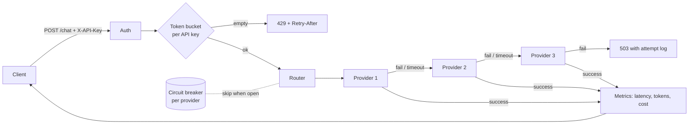

# LLM Gateway
**Live demo:** https://llm-gateway-wae8.onrender.com/dashboard

A small gateway that puts **one `/chat` endpoint** in front of several LLM providers (OpenAI, Anthropic, Gemini). It adds per-key rate limiting, retries with backoff, per-provider circuit breakers and automatic fallback routing, and it tracks latency, tokens and cost. A live dashboard shows what it is doing.

**Local links (after you start it)**

| What | Link |
|---|---|
| Live dashboard | http://localhost:8000/dashboard |
| Interactive API docs | http://localhost:8000/docs |
> The table below is for running the gateway on your own machine. A live, already-running version is linked above.
| Raw metrics (JSON) | http://localhost:8000/metrics |
| Health check | http://localhost:8000/health |

## Quick start

Needs Python 3.11 or newer. No API keys are needed: with no keys it runs on **mock providers** so you can try failover right away.

```bash
# Mac / Linux
./run.sh

# Windows
run.bat

# or by hand
pip install -r requirements.txt
uvicorn app.main:app --port 8000
```

Then open **http://localhost:8000/dashboard**. Click *Send request*, then break `mock-primary` with the **down** button and send again: the answer now comes from `mock-secondary`, and after three failures the primary's circuit opens and it is skipped. Click *Send 30 at once* to see the rate limiter reject requests with 429.

Docker: `docker compose up --build`, same links.

## Try it from the command line

```bash
curl -X POST http://localhost:8000/chat \
  -H "X-API-Key: demo-key" -H "Content-Type: application/json" \
  -d '{"messages":[{"role":"user","content":"Hello"}]}'
```

Response (trimmed):

```json
{"provider": "mock-primary", "content": "[mock-primary] You said: Hello",
 "usage": {"prompt_tokens": 2, "completion_tokens": 5}, "cost_usd": 8.5e-06,
 "latency_ms": 30.4, "gateway_overhead_ms": 0.03, "fallback_used": false,
 "attempts": [{"provider": "mock-primary", "outcome": "ok", "latency_ms": 30.4}]}
```

## Using real providers

Copy `.env.example` to `.env`, add at least one key, and restart. Providers are used in this priority order: OpenAI, Anthropic, Gemini (only those with a key). Override with `PROVIDER_ORDER`.

**Default models (current as of September 2026):**

| Provider | Env var | Default |
|---|---|---|
| OpenAI | `OPENAI_MODEL` | `gpt-4o-mini` |
| Anthropic | `ANTHROPIC_MODEL` | `claude-haiku-4-5-20251001` |
| Gemini | `GEMINI_MODEL` | `gemini-3.8-flash` |

Vendors retire model names over time — Gemini, for example, retired `gemini-2.0-flash` in early 2026. If a provider starts failing with an HTTP 404 saying a model "is no longer available" or "is not found," check that vendor's current model list and set the matching env var in `.env` (e.g. `GEMINI_MODEL=gemini-3.8-flash`), then restart the gateway.

**Verified against the live Gemini API** (`gemini-3.8-flash`) on 22 Sept 2026 — a real `/chat` call returned a genuine model response with `provider: "gemini"` and a non-zero `cost_usd`. The OpenAI and Anthropic adapters use the same HTTP-call pattern and same test coverage, but have not yet been run against those live APIs — test with your own key before relying on them, and update this note once you have.

> Prices in `app/providers.py` are example values: check each vendor's pricing page and edit.

## How a request flows



| Piece | File | What it does |
|---|---|---|
| Rate limiter | `app/ratelimit.py` | Token bucket per API key: allows a burst up to `capacity`, then a steady `refill_per_sec`. |
| Circuit breaker | `app/circuit_breaker.py` | Opens after 3 consecutive failures, skips that provider for 10 s, then lets one probe through (half-open). |
| Router | `app/router.py` | Tries providers in order with a timeout, retries once with exponential backoff and jitter, then falls back. |
| Providers | `app/providers.py` | Common interface; real adapters plus mock providers with failure modes. |
| Metrics | `app/metrics.py` | Counters, p50/p95/p99 latency, per-provider tokens and cost. |
| API | `app/main.py` | FastAPI app: `/chat`, `/metrics`, `/health`, admin endpoints, dashboard. |

### API

| Endpoint | Auth | Purpose |
|---|---|---|
| `POST /chat` | `X-API-Key` or `Authorization: Bearer` | Send `{"messages":[{"role","content"}], "max_tokens", "provider"?}`. |
| `GET /metrics` | none | Live counters, latency percentiles, provider and circuit state. |
| `POST /admin/providers/{name}/mode` | key | Put a **mock** provider in `healthy`, `down`, `slow` or `flaky` mode. |
| `POST /admin/reset` | key | Reset breakers, metrics and rate-limit buckets. |

Status codes: `200` ok, `401` bad key, `422` invalid body, `429` rate limited (with `Retry-After`), `503` every provider failed (body lists each attempt).

## Tests

```bash
pip install -r requirements-dev.txt
pytest -q          # 31 tests: rate limiter, breaker state machine, router fallback, API
```

## Benchmark

`benchmarks/benchmark.py` injects failures into the mock providers and sends 2,000 requests per scenario at concurrency 50.

```bash
REQUEST_TIMEOUT_S=1 uvicorn app.main:app --port 8000      # shorter timeout so the "hang" scenario finishes quickly
python benchmarks/benchmark.py --requests 2000 --concurrency 50
```

Results from one run (2,000 requests per scenario, 30 ms mock provider latency):

| Scenario | Success | Served by fallback | Req/s | p50 | p95 | p99 | Gateway overhead (mean) |
|---|---|---|---|---|---|---|---|
| Healthy (all providers up) | 100.0% | 0.0% | 183.1 | 198.3 ms | 699.9 ms | 1081.6 ms | 0.009 ms |
| Primary down | 100.0% | 100.0% | 205.7 | 180.5 ms | 618.9 ms | 904.4 ms | 0.018 ms |
| Primary + secondary down | 100.0% | 100.0% | 236.6 | 154.3 ms | 546.3 ms | 763.4 ms | 0.018 ms |
| Primary hangs (timeouts) | 100.0% | 100.0% | 163.1 | 189.0 ms | 933.5 ms | 1258.5 ms | 0.027 ms |
| Primary flaky (30% errors) | 100.0% | 11.65% | 171.6 | 226.3 ms | 708.6 ms | 1056.8 ms | 0.123 ms |
| Total outage (all down) | 0.0% | 0.0% | 303.7 | n/a | n/a | n/a | n/a |
**How to read these numbers honestly**

- The three columns that matter are **Success**, **Served by fallback** and **Gateway overhead**. Success stayed at 100% in every scenario where at least one provider was still up, including when the primary hung (requests timed out at 1 s and fell back).
- **Gateway overhead** is measured inside the router: total time minus provider time minus deliberate backoff sleeps. It excludes HTTP parsing and network.
- **Req/s and latency percentiles are not a capacity claim.** This run used a 1-core sandbox where the load generator and the gateway shared the same CPU, so latencies include queueing. Re-run on your own machine for numbers you can quote.
- The providers are mocks. Real provider latency will dominate end-to-end time.

## Resume bullets (based on the run above, adjust to your own re-run)

- Built an async LLM gateway (FastAPI) exposing one `/chat` API over multiple providers, with per-key token-bucket rate limiting, retries with exponential backoff, per-provider circuit breakers and priority fallback routing.
- Kept 100% request success across 2,000-request failure-injection runs with the primary provider down, hanging or flaky, with under 0.15 ms of in-process routing overhead.
- Added a live dashboard, cost and token accounting per provider, and a 31-test suite covering the rate limiter, breaker state machine and failover paths.

## Ideas to extend

- Redis-backed rate limiter so limits are shared across several gateway instances (the in-memory one is per process).
- Semantic caching in front of the router; streaming responses; cost-based routing instead of fixed priority.
- Prometheus `/metrics` export and a Grafana dashboard.
